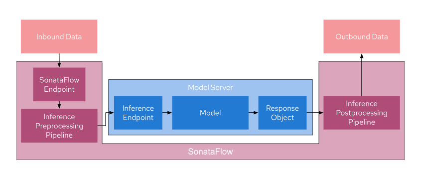

# sonataflow-inference-pipeline-demo

The goal of this project is to create an inference pipeline for image segmentation tasks for images from the COCO Dataset using SonataFlow. This pipeline wraps around a model server and consists of three main components:

1. Inference Pre-processing Pipeline: This is the initial stage of the pipeline where incoming image data is pre-processed before being sent to the model server. Pre-processing may involve tasks such as resizing, data augmentation, or any other necessary transformations.
2. Model Server: The model server is responsible for loading and executing the image segmentation model. It receives pre-processed data, performs inference, and returns the segmentation results.
3. Inference Post-processing Pipeline: After receiving the model's output, the post-processing pipeline may apply additional operations to the results, such as filtering, thresholding, or any other necessary post-processing steps.

Once the inference is complete, the results are returned to the calling process. Any request that needs to be pre/post processed is, therefore, sent to the SonataFlow Endpoint, while requests that do not need processing can still use the original inference endpoint.

The below image illustrates the use-case:



## Pipeline Overview

The pipeline is defined as a [Serverless Workflow](https://serverlessworkflow.io/) specified in [pipeline.sw.yaml](src/main/resources/pipeline.sw.yaml).

It takes an image as input and produces a segmented image as output. The pipeline consists of four main states:

### 1. Imports

In this initial state, a Python script is executed to import the necessary dependencies and modules for the subsequent states.

### 2. Create KServe Payload

This state invokes a Python function to construct the request payload that will be sent to KServe. This payload is based on the input image.

### 3. Invoke KServe

In this state, a request is sent to KServe using the payload created in the previous state. Once KServe responds, the execution proceeds to the next state.

### 4. Handle KServe Response

The final state manages the response received from KServe, which contains segmentation data. A Python function is responsible for processing this response data and generating the output image with segmentation information.

## Interaction with ODH
It's important to note that SonataFlow and Open Data Hub(ODH) need not be deployed in the same location. As long as your workflow can access the ODH endpoint, you can leverage ODH's capabilities in conjunction with SonataFlow.

If you want to learn more about SonataFlow, please visit its website: https://sonataflow.org/ .

## Deploying to OpenShift

### Install the SonataFlow operator

```shell
kubectl create -f https://raw.githubusercontent.com/apache/incubator-kie-kogito-serverless-operator/main/operator.yaml
```

### Switch to your namespace

```shell
kubectl config set-context --current --namespace=$NAMESPACE
```

### Deploy the artifacts

```shell
./deploy.sh
```

### Check the deployment status

```shell
kubectl get workflow pipeline
```

You should see an output like the following when the workflow is ready:

```shell
NAME       PROFILE   VERSION   URL                                  READY   REASON
pipeline   dev       1.0       http://192.168.67.2:30012/pipeline   True
```

## Sending a request

To perform image segmentation on `src/main/resources/images/coco_image.jpg`, open http://192.168.67.2:30012 (This is just an example. Run the above command to get the right URL.) in your browser, upload the file, and click the 'Process Image' button.

Processing may take approximately one minute. Afterward, you should see the segmented image displayed as follows:


## Related Guides

- Kogito - Serverless Workflow ([guide](https://quarkus.io/version/2.13/guides/kogito)): Add Kogito Serverless Workflows (SW) capabilities - Includes the Process engine capability
- SmallRye OpenAPI ([guide](https://quarkus.io/guides/openapi-swaggerui)): Document your REST APIs with OpenAPI - comes with Swagger UI
