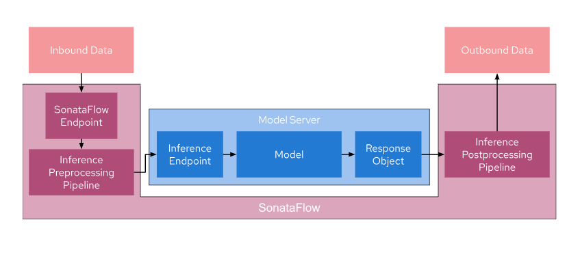

# sonataflow-inference-pipeline-demo

The goal of this project is to create an inference pipeline for image segmentation tasks for images from the COCO Dataset using SonataFlow. This pipeline wraps around a model server and consists of three main components:

1. Inference Pre-processing Pipeline: This is the initial stage of the pipeline where incoming image data is pre-processed before being sent to the model server. Pre-processing may involve tasks such as resizing, data augmentation, or any other necessary transformations.
2. Model Server: The model server is responsible for loading and executing the image segmentation model. It receives pre-processed data, performs inference, and returns the segmentation results.
3. Inference Post-processing Pipeline: After receiving the model's output, the post-processing pipeline may apply additional operations to the results, such as filtering, thresholding, or any other necessary post-processing steps.

Once the inference is complete, the results are returned to the calling process. Any request that needs to be pre/post processed is, therefore, sent to the SonataFlow Endpoint, while requests that do not need processing can still use the original inference endpoint.

The below image illustartes the usecase:



## Interaction with ODH
It's important to note that SonataFlow and Open Data Hub(ODH) need not be deployed in the same location. As long as your workflow can access the ODH endpoint, you can leverage ODH's capabilities in conjunction with SonataFlow.

If you want to learn more about SonataFlow, please visit its website: https://sonataflow.org/ .
## Running the application in dev mode

You can run your application in dev mode that enables live coding using:
```shell script
./mvnw compile quarkus:dev
```

> **_NOTE:_**  Quarkus now ships with a Dev UI, which is available in dev mode only at http://localhost:8080/q/dev/.

## Sending a request

To perform image segmentation in `coco_image.jpg`, run the following request:

```shell
curl -X 'POST' \
  'http://localhost:8080/inference' \
  -H 'accept: */*' \
  -H 'Content-Type: application/json' \
  -d '{ "image": "coco_image.jpg" }'
```

You should see an output similar to:

```shell
{"id":"591f8305-908b-43d0-85c7-73be87f8f0ca","workflowdata":{"output_image":"./output_image.jpg"}}
```

`./output_image.jpg` is the result image of the segmentation process.

## Packaging and running the application

The application can be packaged using:
```shell script
./mvnw package
```
It produces the `quarkus-run.jar` file in the `target/quarkus-app/` directory.
Be aware that it’s not an _über-jar_ as the dependencies are copied into the `target/quarkus-app/lib/` directory.

The application is now runnable using `java -jar target/quarkus-app/quarkus-run.jar`.

If you want to build an _über-jar_, execute the following command:
```shell script
./mvnw package -Dquarkus.package.type=uber-jar
```

The application, packaged as an _über-jar_, is now runnable using `java -jar target/*-runner.jar`.

## Creating a native executable

You can create a native executable using: 
```shell script
./mvnw package -Dnative
```

Or, if you don't have GraalVM installed, you can run the native executable build in a container using: 
```shell script
./mvnw package -Dnative -Dquarkus.native.container-build=true
```

You can then execute your native executable with: `./target/sonataflow-inference-pipeline-demo-1.0.0-SNAPSHOT-runner`

If you want to learn more about building native executables, please consult https://quarkus.io/guides/maven-tooling.

## Related Guides

- Kogito - Serverless Workflow ([guide](https://quarkus.io/version/2.13/guides/kogito)): Add Kogito Serverless Workflows (SW) capabilities - Includes the Process engine capability
- SmallRye OpenAPI ([guide](https://quarkus.io/guides/openapi-swaggerui)): Document your REST APIs with OpenAPI - comes with Swagger UI
